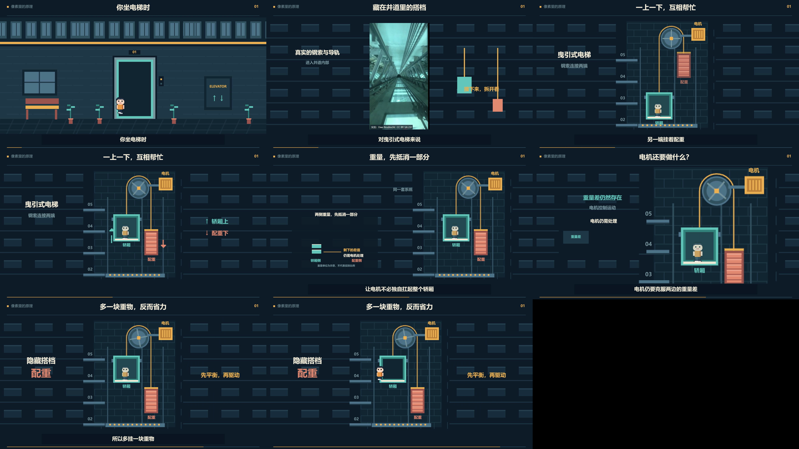

# Pixel Explainer Workflow · 像素科普动画制作

**[制作规则与技能入口](SKILL.md)** · **[动作、声音和检查细则](docs/PROJECT_EXTENSIONS.md)** · **[完整上游技能](upstream/claude-video-studio/SKILL.md)**

## 新版：可复用的人物故事模板

[模板使用说明](docs/STORY_TEMPLATE.md) · 三个人物各 20 姿势、手部持物、四相位走路、推拉操作、15 类 8-bit 音色、可选自带旁白。默认示范人物约占画面高的 12%，关键操作才放大。还提供本次完整织布故事的场景代码作为可选示例。


[播放／下载 32 秒动作示范（纯音效）](demo/acting-template.mp4)

安装下方依赖后，在仓库目录运行：

```bash
python tools/story.py init projects/my-story
python tools/story.py prepare projects/my-story
python tools/story.py render projects/my-story
python tools/story.py check projects/my-story
```

输出 `projects/my-story/renders/film.mp4`。默认是 32 秒动作示范、只有音效；真实影片时长由使用者在项目中设定。更换知识点需要改脚本、场景、字幕与接触音时间，不是只换标题就自动生成故事。完整示例使用 `init projects/example --example capital`，不附私人配音。

制作时按规则准备主角的 15–25 种姿势，完成走路、转身、操作、交接和反应；道具绑定接触点，8-bit 音效按动作区分音色与节奏。先生成旁白再对齐时间轴，默认 GPU 优先，导出后检查实际动作和混音。

把一段知识讲解做成像素动画：角色逐帧动作、关系示意、字幕、8-bit 音效、可选本地配音，再用 HyperFrames 导出视频。

这里公开制作方法、通用人物动作模板、完整织布故事场景及早期电梯样例。以下电梯示例保留其原实现；新版人物模板通过上面的独立入口使用。更换知识点仍要设计场景、动作和时间轴，没有自动选题或一键生成任意故事的功能。



**[播放／下载 25 秒演示](demo/elevator-sfx-demo.mp4)** · 1920×1080 · 30 fps · 只有音效，无旁白

## 电梯演示内容

- 用同一套像素对象演示轿厢与配重的反向运动、重量配对和电机的作用。
- 把竖屏草稿重新排成 16:9，大厅、井道、比较区都有横向布局。
- 用统一时间映射把 30 秒动画、字幕和音效加速为 25 秒；可选旁白用 FFmpeg `atempo` 同步变速。
- 生成 28 个确定性的 8-bit 音效事件，保留事件清单，独立调整人声与音效增益。
- 记录一个有署名的电梯井实拍来源，并把短片段接到像素结构演示。
- 使用真实配音词时序制作示例字幕；检查编码尺寸、帧数、时长及全程解码。

公开演示使用纯音效轨。个人参考声音、原始克隆配音、模型权重及远程连接配置不随仓库分发。可以用自己有权使用的旁白接入，见 [VoxCPM 配音说明](docs/VOICE.md)。

## 快速开始

需要 **Node.js 22+、Python 3.10+、FFmpeg/ffprobe**。中文需要系统装有微软雅黑、苹方或 Noto Sans CJK SC。Ubuntu 可安装 `fonts-noto-cjk`。第一次运行渲染器可能下载 Chromium；仅运行公开示例不需要 TTS 模型。

**默认 GPU 优先，无可用 GPU 才回退 CPU。** 浏览器画面捕获采用 HyperFrames 的 GPU 自动探测；导出默认启用 `--gpu`，探测可用的硬件编码器，未找到才使用软件编码。可选配音入口 `tts.py` 按 CUDA → MPS → CPU 选择并实际探测设备。音效合成和混音是轻量 CPU 处理；它们不属于 GPU 推理或视频编码。

```bash
git clone https://github.com/mengyuyuan/pixel-explainer-workflow.git
cd pixel-explainer-workflow
npm ci
python -m pip install -r requirements.txt
python pipeline.py prepare
npm run preview
```

终端会输出预览地址。导出与技术检查：

```bash
python pipeline.py render
python pipeline.py check
```

视频输出到 `renders/elevator-sample.mp4`。技术报告在 `build/technical-check.json`。本仓库的演示仍是样片；自动解码和静帧检查不能代替正常速度观看与主观听审。

## 改节奏和音量

编辑 `config.json`，再运行 `python pipeline.py prepare`：

```json
{
  "playbackRate": 1.2,
  "sfxGainDB": 7,
  "voiceGainDB": -6.5,
  "voiceOffsetSeconds": 0.5
}
```

`playbackRate: 1.2` 是原速度的 120%，输出时长为 `30 / 1.2 = 25` 秒。`sfxGainDB` 相对于脚本生成的基础音效轨；大幅提高后需重听并检查峰值。速度必须在 0.5–2 之间，并满足 `900 / playbackRate` 为整数帧，例如 1、1.2、1.5、2。

`voiceOffsetSeconds` 只调整旁白在源时间轴上的位置。修改它时，也要相应核对字幕和动作时间。

加入自己的配音：

```bash
python pipeline.py prepare --voice /path/to/your-narration.wav
python pipeline.py render
```

示例时间轴对应仓库内 `narration.txt` 的一次朗读。新的录音即使文案相同，停顿也可能不同；需要重新核对 `timing.json` 的字幕、`build_scene.py` 与 `scene-core.js` 的动作，以及 `synthesize_sfx.py` 的事件时间。工具会拒绝超过源时间轴长度的旁白，不会悄悄切掉句尾。

## 方法与文件

完整操作顺序、这次踩到的问题及换主题边界见 [制作方法](docs/WORKFLOW.md)。

| 文件 | 作用 |
| --- | --- |
| `scene-core.js` | 角色、大厅、钢索、配重、重量配对、电机等绘制与动作 |
| `build_scene.py` | 横版构图、字幕、GSAP 绝对时间轴及 HTML 入口 |
| `make_sprites.py` | 生成 7 种角色姿势 |
| `timing.json` | 30 秒源时间轴的镜头区间和字幕 |
| `synthesize_sfx.py` | 生成动作对应的音效与事件记录 |
| `mix_audio.py` | 可选配音、音效增益、同步变速和混音 |
| `pipeline.py` | 准备、渲染、技术检查入口 |
| `tts.py` | GPU 优先的可选 VoxCPM 配音入口 |

## 来源与许可

本项目自编代码及文档采用 **MIT**。使用的 `vendor/pixel_sprite.py` 来自 [claude-video-studio](https://github.com/a252937166/claude-video-studio)，保留原 MIT 许可；本项目基于其精灵工具和教程方法扩展了具体科普场景、横版构图及混音流程。

`assets/shaft-excerpt.mp4`、含该实拍的演示视频及截图采用 **CC BY-SA 2.0**，作者与修改说明见 [第三方来源](THIRD_PARTY_NOTICES.md)。这些媒体不属于根目录 MIT 许可的范围。npm 依赖按各自许可安装，不捆绑进源码。

原理参考：[Otis — The Basic Workings of a Lift](https://www.otis.com/en/uk/w/the-basic-workings-of-a-lift)。样例仅解释曳引式电梯；画面中的重量块为定性示意，不代表实际设计比例。
